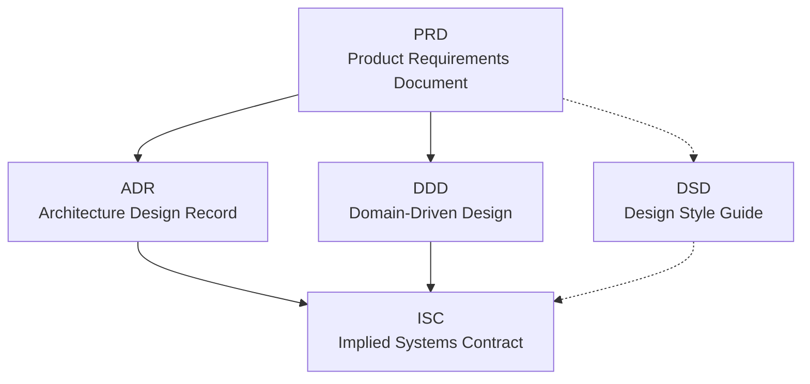

# agentic_design_workflow

Source of truth for agentic development processes and procedures.

## Purpose

This repository documents the end-to-end workflow used to plan and specify
software that will be implemented with the help of agentic systems. It
defines the document types, the order they are authored in, and how they
hand off to one another, so that work can later be sliced into units an
agent can execute reliably.

The workflow flows **`PRD → ADR → DDD → ISC → DSD → Slicing`**. Templates
for all five documents live under [`templates/`](templates/); the slicing
step is owned by the [Shredder](agents/Shredder.md) agent, which consumes
the completed bundle and dispatches agent-executable tasks.

## The five documents

| # | Doc | Full name | Answers |
|---|-----|-----------|---------|
| 1 | PRD | Product Requirements Document | *What* are we building, for whom, and why? |
| 2 | ADR | Architecture Design Record | *How*, at the system level, are we going to build it? |
| 3 | DDD | Domain-Driven Design (domain model) | What is the domain — bounded contexts, entities, ubiquitous language? |
| 4 | ISC | Implied Systems Contract | What contracts between systems fall out of the architecture and domain model? |
| 5 | DSD | Design Style Guide | What conventions (UX, visual, code) must every slice conform to? |

### PRD — Product Requirements Document
Captures problem, users, goals, non-goals, success metrics, and functional
and non-functional requirements. Upstream source of truth for *why* any
work is being done. Every downstream document must trace back to a PRD
entry.

### ADR — Architecture Design Record
Records significant architecture decisions: chosen approach, alternatives
considered, consequences, and status. Anchors the *how* at a system level
and constrains the DDD and ISC.

### DDD — Domain-Driven Design
The domain model, authored following Domain-Driven Design practice:
bounded contexts, aggregates, entities, value objects, domain events, and
the ubiquitous language shared across PRD, ADR, ISC, and DSD. Prevents
model drift across teams and agents.

### ISC — Implied Systems Contract
The contracts (APIs, schemas, events, integration points) that are
*implied* by combining the architecture (ADR) with the domain model (DDD).
This is the interface boundary every implementation slice must respect.

### DSD — Design Style Guide
Cross-cutting conventions for look, feel, interaction, and code style.
Applies to every slice regardless of where it sits in the domain.

## Workflow



Solid arrows are authoring dependencies (the target cannot be completed
until the source is stable). Dotted arrows are cross-cutting influences
(the source constrains the target but does not block its authoring).

### Hand-offs

| From → To | What flows across |
|-----------|-------------------|
| PRD → ADR | Requirements and constraints driving architecture choices |
| PRD → DDD | Domain language, user goals, business rules |
| ADR → ISC | System boundaries, deployment units, technology choices |
| DDD → ISC | Bounded contexts, aggregates, domain events |
| PRD ⇢ DSD | Product tone, target users, brand constraints |
| DSD ⇢ ISC | Style constraints applied to every externally visible surface |

### Ordering rules

1. **PRD is authored first.** No other document starts until the PRD is
   stable enough to reference.
2. **ADR and DDD are authored in parallel** once the PRD is stable.
3. **ISC depends on both ADR and DDD** being stable enough to name the
   contracts.
4. **DSD is a living document.** It is initiated alongside the PRD and
   evolves in parallel; it binds the ISC and every downstream slice.
5. **Changes propagate downstream.** A PRD change may invalidate ADR,
   DDD, or ISC; impact must be tracked explicitly and the affected
   documents re-reviewed.

## Templates & authoring guides

Each of the five upstream documents has a **template** (the shape) and an
**authoring-and-review guide** (how to fill it well and how to review it).
Templates live in [`templates/`](templates/); guides in
[`guides/`](guides/). Start with [`guides/README.md`](guides/README.md) for
the shared principles.

| Doc | Template | Guide |
|-----|----------|-------|
| PRD | [`templates/PRD-template.md`](templates/PRD-template.md) | [`guides/PRD-guide.md`](guides/PRD-guide.md) |
| ADR | [`templates/ADR-template.md`](templates/ADR-template.md) | [`guides/ADR-guide.md`](guides/ADR-guide.md) |
| DDD | [`templates/DDD-template.md`](templates/DDD-template.md) | [`guides/DDD-guide.md`](guides/DDD-guide.md) |
| ISC | [`templates/ISC-template.md`](templates/ISC-template.md) | [`guides/ISC-guide.md`](guides/ISC-guide.md) |
| DSD | [`templates/DSD-template.md`](templates/DSD-template.md) | [`guides/DSD-guide.md`](guides/DSD-guide.md) |

## From idea to shipped slice

Design starts with **April**, the reporter. She interviews the user
and iteratively drafts the five upstream documents into the project's
document tree using the templates in [`templates/`](templates/).
Nothing advances until the user explicitly marks each document
Approved and hands the bundle to Shredder.

Once the five upstream documents are approved, the **Shredder** agent
consumes the bundle, validates it for cross-document conflicts, and
produces a dependency-ordered slice queue. Shredder hands that queue
to **Karai**, the execution supervisor, who dispatches each slice in
order to the assigned execution agent (Bebop, Baxter, Tatsu, or
Krang), validates every returned output against the contract that
agent is bound to, sends the slice through **Bishop** for
principal-level review and **Tiger Claw** for adversarial QA,
verifies the state file was updated, and escalates to the human the
moment conformance breaks.

| Agent | Role | File |
|-------|------|------|
| April | Design-phase elicitor & document author (upstream of Shredder) | [`agents/April.md`](agents/April.md) |
| Shredder | Slicer & queue author | [`agents/Shredder.md`](agents/Shredder.md) |
| Karai | Execution supervisor & dispatcher | [`agents/Karai.md`](agents/Karai.md) |
| Traag | Filesystem scope enforcer (cross-cutting) | [`agents/Traag.md`](agents/Traag.md) |
| Krang | Infrastructure & DevOps (Layer 1, deploy L6) | [`agents/Krang.md`](agents/Krang.md) |
| Baxter | Math-heavy / algorithmic execution | [`agents/Baxter.md`](agents/Baxter.md) |
| Tatsu | Security-minded execution (Layer 3 + security-critical cross-cutting) | [`agents/Tatsu.md`](agents/Tatsu.md) |
| Chaplin | Data / schema specialist (non-trivial L2 + data-migration L6) | [`agents/Chaplin.md`](agents/Chaplin.md) |
| Metalhead | Observability engineer (L1 scaffold, instrumentation, SLO / alerts / dashboards) | [`agents/Metalhead.md`](agents/Metalhead.md) |
| Splinter | Technical writer (human-facing docs derived from shipped code and state) | [`agents/Splinter.md`](agents/Splinter.md) |
| Bebop | Standard execution (Layers 2 trivial, 4, 5, non-deploy L6) | [`agents/Bebop.md`](agents/Bebop.md) |
| Bishop | Principal-level code review (post-structural, pre-QA) | [`agents/Bishop.md`](agents/Bishop.md) |
| Tiger Claw | Adversarial QA (post-review, pre-completion) | [`agents/TigerClaw.md`](agents/TigerClaw.md) |

The flow is **User ↔ April → Shredder → Karai → {Bebop | Baxter |
Chaplin | Metalhead | Splinter | Tatsu | Krang} → Karai (structural)
→ Bishop (review) → Tiger Claw (adversarial) → Karai → next slice**,
with **Traag** wrapping every filesystem mutation any agent attempts. April owns design-phase
elicitation and authoring; Bishop runs before Tiger Claw so cycles
are not spent attacking code a principal-engineer reviewer would
reject on sight; a Block verdict from Bishop halts the slice and
routes back to the author via Shredder re-slice. Tatsu owns Layer 3 by default and any slice
whose Traces-to touches a security-critical surface (Security /
External Integration / Data Integrity ISCs, security / privacy NFRs,
PII / credential / secret / audit DDD elements, or trust-boundary
crossings). Shredder's slicing order follows a 6-layer
dependency hierarchy (Foundation → Data → Security → Logic → Interface
→ Features) and groups slices within each layer by DDD bounded
context. Every slice cites the specific `[FR-*]`, `[NFR-*]`, `ADR-N`,
DDD element, `[ISC-NNN]`, and `[DSD-###]` it touches — and Karai
enforces that every returned output preserves those citations and
upholds every cited invariant before the queue advances.

Traag closes the scope-security gap that raw harness permissions cannot
express: instead of "allow all writes" or "prompt on every write,"
Traag evaluates each `Write` / `Edit` / delete against a per-slice
scope manifest plus a global denylist (secrets, `.git`, lock files,
infra config outside Krang's slices, upstream design artifacts). Deny
is the default on any ambiguity; a DENY blocks the mutation and fires
as a Red inspection outcome in Karai, halting the slice and surfacing
the Violation Report to the human. There is no "just this once"
override — amendments happen upstream by amending the manifest or
re-slicing via Shredder.

## Using this as a Claude Code plugin

This repository is packaged as a Claude Code plugin so a new project
can adopt the entire workflow — all thirteen subagents, scope
enforcement, and slash commands — in one step.

### Install

```bash
# From this git repo (replace <git-url> with the clone URL)
claude plugin install <git-url>

# Or from a local checkout, for development
claude --plugin-dir /path/to/agentic_design_workflow
```

Verify:

```bash
claude plugin list
claude plugin validate
```

Requires `bash` and `jq` on PATH for the scope-enforcement hook. Without
`jq` the hook fails open with a warning; set `STRICT_GUARD=1` to fail
closed instead.

### Session ritual

Four slash commands, namespaced under `shredder:`:

| Command | Purpose |
|---------|---------|
| `/shredder:elicit` | Run April to interview you and author / iterate the five upstream documents. |
| `/shredder:slice` | Run Shredder on the approved bundle to produce a dependency-ordered slice queue at `slices/queue.md`. |
| `/shredder:execute-next` | Run Karai on the next pending slice — dispatches the assigned executor, routes through Bishop review and Tiger Claw QA, records state. |
| `/shredder:status` | Read-only report on upstream-document status, queue progress, active slice, gate telemetry, and open escalations. |

Typical rhythm on a new project:

1. **Session 1 — elicit.** `/shredder:elicit` until every upstream doc is Approved / Accepted and April's Readiness Brief returns green across the board.
2. **Session 2 — slice.** `/shredder:slice` produces the queue.
3. **Sessions 3…N — execute.** `/shredder:execute-next` per slice. `/shredder:status` any time to check where things are.

### Scope enforcement

A `PreToolUse` hook on `Write` / `Edit` reads `.claude/state/active-slice.json`
(written by `/shredder:elicit`, `/shredder:slice`, and
`/shredder:execute-next` before dispatch) and blocks writes outside the
slice's declared allowlist. A universal denylist also protects the
design scaffolds (`templates/**`, `guides/**`) and instantiated upstream
bundle (`docs/PRD*`, `docs/ADR*`, `docs/DDD*`, `docs/ISC*`, `docs/DSD*`
and repo-root variants) from edits by anyone other than April (or an
explicit `CLAUDE_WORKFLOW_META=1` override for plugin-internal work).

Blocks return exit code 2 with a stderr message that surfaces to Claude
as the reason. Extending scope is a deliberate edit to
`.claude/state/active-slice.json` — there is no "just this once"
bypass.

### Pipeline modes

Two modes, selected per project via `.claude/workflow.json`:

- **`full`** (default) — Bishop review + Tiger Claw QA on every slice.
- **`lightweight`** — those gates run only on slices Shredder tags
  `review_required: true` based on criteria in
  [`guides/pipeline-modes.md`](guides/pipeline-modes.md) (security,
  non-trivial data, external-contract changes, production infra,
  irreversibility, observability contracts, size thresholds, or
  explicit author opt-in).

Karai's structural conformance, Traag's scope enforcement, and every
executor's showpiece run in both modes. Lightweight only trims Bishop
and Tiger Claw. Adopting lightweight mode should be captured as the
project's first ADR — opinionated template in
[`guides/pipeline-modes.md`](guides/pipeline-modes.md).

## Status

- [x] Workflow overview (this document)
- [x] PRD template
- [x] ADR template
- [x] DDD template
- [x] ISC template
- [x] DSD template
- [x] Design-phase elicitor (April)
- [x] Slicing procedure (Shredder)
- [x] Execution supervisor (Karai)
- [x] Scope enforcer (Traag)
- [x] Krang agent (infra / deploy)
- [x] Baxter agent (algorithmic execution)
- [x] Tatsu agent (security-minded execution, Layer 3)
- [x] Chaplin agent (data / schema specialist, non-trivial Layer 2)
- [x] Metalhead agent (observability engineer)
- [x] Splinter agent (technical writer)
- [x] Bebop agent (standard execution)
- [x] Code reviewer (Bishop)
- [x] Adversarial QA (Tiger Claw)
- [x] Authoring and review guides (PRD · ADR · DDD · ISC · DSD)
- [x] Plugin packaging (`.claude-plugin/plugin.json`)
- [x] Slash commands (`/shredder:elicit` · `/shredder:slice` · `/shredder:execute-next` · `/shredder:status`)
- [x] Scope-enforcement hook (`hooks/hooks.json` + `scripts/guard.sh`)
- [x] Pipeline modes — full vs. lightweight ([`guides/pipeline-modes.md`](guides/pipeline-modes.md))
