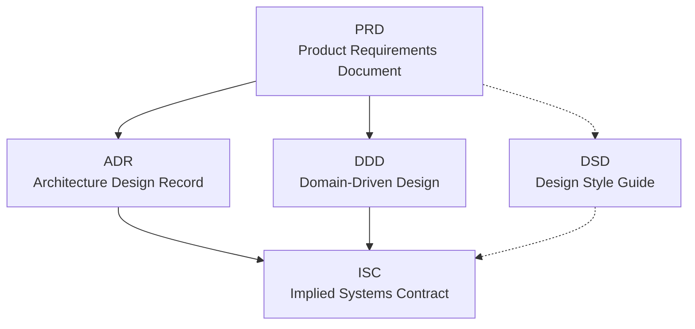

# agentic_design_workflow

Source of truth for agentic development processes and procedures.

## Purpose

This repository documents the end-to-end workflow used to plan and specify
software that will be implemented with the help of agentic systems. It
defines the document types, the order they are authored in, and how they
hand off to one another, so that work can later be sliced into units an
agent can execute reliably.

**Scope of this first pass:** overview of the `PRD → ADR → DDD → ISC → DSD`
pipeline only. Templates, authoring guides, review gates, agent prompts,
and the slicing procedure itself will be added in subsequent passes.

## The five documents

| # | Doc | Full name | Answers |
|---|-----|-----------|---------|
| 1 | PRD | Product Requirements Document | *What* are we building, for whom, and why? |
| 2 | ADR | Architecture Design Record | *How*, at the system level, are we going to build it? |
| 3 | DDD | Domain-Driven Design (domain model) | What is the domain — bounded contexts, entities, ubiquitous language? |
| 4 | ISC | Implied Systems Contract | What contracts between systems fall out of the architecture and domain model? |
| 5 | DSD | Design Style Guide | What conventions (UX, visual, code) must every slice conform to? |

### PRD — Product Requirements Document
Captures problem, users, goals, non-goals, success metrics, and functional
and non-functional requirements. Upstream source of truth for *why* any
work is being done. Every downstream document must trace back to a PRD
entry.

### ADR — Architecture Design Record
Records significant architecture decisions: chosen approach, alternatives
considered, consequences, and status. Anchors the *how* at a system level
and constrains the DDD and ISC.

### DDD — Domain-Driven Design
The domain model, authored following Domain-Driven Design practice:
bounded contexts, aggregates, entities, value objects, domain events, and
the ubiquitous language shared across PRD, ADR, ISC, and DSD. Prevents
model drift across teams and agents.

### ISC — Implied Systems Contract
The contracts (APIs, schemas, events, integration points) that are
*implied* by combining the architecture (ADR) with the domain model (DDD).
This is the interface boundary every implementation slice must respect.

### DSD — Design Style Guide
Cross-cutting conventions for look, feel, interaction, and code style.
Applies to every slice regardless of where it sits in the domain.

## Workflow

Solid arrows are authoring dependencies (the target cannot be completed
until the source is stable). Dotted arrows are cross-cutting influences
(the source constrains the target but does not block its authoring).

### Hand-offs

| From → To | What flows across |
|-----------|-------------------|
| PRD → ADR | Requirements and constraints driving architecture choices |
| PRD → DDD | Domain language, user goals, business rules |
| ADR → ISC | System boundaries, deployment units, technology choices |
| DDD → ISC | Bounded contexts, aggregates, domain events |
| PRD ⇢ DSD | Product tone, target users, brand constraints |
| DSD ⇢ ISC | Style constraints applied to every externally visible surface |

### Ordering rules

1. **PRD is authored first.** No other document starts until the PRD is
   stable enough to reference.
2. **ADR and DDD are authored in parallel** once the PRD is stable.
3. **ISC depends on both ADR and DDD** being stable enough to name the
   contracts.
4. **DSD is a living document.** It is initiated alongside the PRD and
   evolves in parallel; it binds the ISC and every downstream slice.
5. **Changes propagate downstream.** A PRD change may invalidate ADR,
   DDD, or ISC; impact must be tracked explicitly and the affected
   documents re-reviewed.

## Status

- [x] Workflow overview (this document)
- [ ] Per-document templates
- [ ] Authoring and review guides
- [ ] Agent prompts and playbooks
- [ ] Slicing procedure for agent-executable work units
