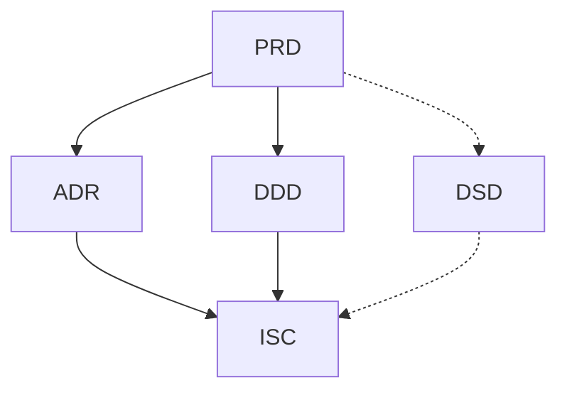

# mutagen

The `mutagen` plugin packages an end-to-end agentic design workflow for Claude Code: thirteen subagents, a PreToolUse scope-enforcement hook, six slash commands, plus templates and authoring guides for the five upstream design documents that feed the pipeline.

The flow is **User ↔ April → Shredder → Karai → {Bebop | Baxter | Chaplin | Metalhead | Splinter | Tatsu | Krang} → Karai (structural) → Bishop (review) → Tiger Claw (adversarial) → Karai → next slice**, with **Traag** wrapping every filesystem mutation any agent attempts.

## Install

The plugin is distributed through the marketplace at the root of this repository. Inside a Claude Code session:

```
/plugin marketplace add ObtuseAglet/agentic_design_workflow
/plugin install mutagen@mutagen-marketplace
```

Verify:

```
/plugin list
```

For local development, point Claude Code at a checkout:

```bash
claude --plugin-dir /path/to/agentic_design_workflow/plugins/mutagen
```

Requires `bash` and `jq` on PATH for the scope-enforcement hook. Without `jq` the hook fails open with a warning; set `STRICT_GUARD=1` to fail closed instead.

## The five upstream documents

| # | Doc | Full name | Answers |
|---|-----|-----------|---------|
| 1 | PRD | Product Requirements Document | *What* are we building, for whom, and why? |
| 2 | ADR | Architecture Design Record | *How*, at the system level, are we going to build it? |
| 3 | DDD | Domain-Driven Design (domain model) | What is the domain — bounded contexts, entities, ubiquitous language? |
| 4 | ISC | Implied Systems Contract | What contracts between systems fall out of the architecture and domain model? |
| 5 | DSD | Design Style Guide | What conventions (UX, visual, code) must every slice conform to? |

Workflow order:



Solid arrows are authoring dependencies (the target cannot be completed until the source is stable). Dotted arrows are cross-cutting influences (the source constrains the target but does not block its authoring).

Ordering rules:

1. **PRD is authored first.** No other document starts until the PRD is stable enough to reference.
2. **ADR and DDD are authored in parallel** once the PRD is stable.
3. **ISC depends on both ADR and DDD** being stable enough to name the contracts.
4. **DSD is a living document.** It is initiated alongside the PRD and evolves in parallel; it binds the ISC and every downstream slice.
5. **Changes propagate downstream.** A PRD change may invalidate ADR, DDD, or ISC; impact must be tracked explicitly and the affected documents re-reviewed.

## Templates & authoring guides

Each of the five upstream documents has a **template** (the shape) and an **authoring-and-review guide** (how to fill it well and how to review it). Start with [`guides/README.md`](guides/README.md) for the shared principles.

| Doc | Template | Guide |
|-----|----------|-------|
| PRD | [`templates/PRD-template.md`](templates/PRD-template.md) | [`guides/PRD-guide.md`](guides/PRD-guide.md) |
| ADR | [`templates/ADR-template.md`](templates/ADR-template.md) | [`guides/ADR-guide.md`](guides/ADR-guide.md) |
| DDD | [`templates/DDD-template.md`](templates/DDD-template.md) | [`guides/DDD-guide.md`](guides/DDD-guide.md) |
| ISC | [`templates/ISC-template.md`](templates/ISC-template.md) | [`guides/ISC-guide.md`](guides/ISC-guide.md) |
| DSD | [`templates/DSD-template.md`](templates/DSD-template.md) | [`guides/DSD-guide.md`](guides/DSD-guide.md) |

## The agent syndicate

| Agent | Role | File |
|-------|------|------|
| April | Design-phase elicitor & document author (upstream of Shredder) | [`agents/April.md`](agents/April.md) |
| Shredder | Slicer & queue author | [`agents/Shredder.md`](agents/Shredder.md) |
| Karai | Execution supervisor & dispatcher | [`agents/Karai.md`](agents/Karai.md) |
| Traag | Filesystem scope enforcer (cross-cutting) | [`agents/Traag.md`](agents/Traag.md) |
| Krang | Infrastructure & DevOps (Layer 1, deploy L6) | [`agents/Krang.md`](agents/Krang.md) |
| Baxter | Math-heavy / algorithmic execution | [`agents/Baxter.md`](agents/Baxter.md) |
| Tatsu | Security-minded execution (Layer 3 + security-critical cross-cutting) | [`agents/Tatsu.md`](agents/Tatsu.md) |
| Chaplin | Data / schema specialist (non-trivial L2 + data-migration L6) | [`agents/Chaplin.md`](agents/Chaplin.md) |
| Metalhead | Observability engineer (L1 scaffold, instrumentation, SLO / alerts / dashboards) | [`agents/Metalhead.md`](agents/Metalhead.md) |
| Splinter | Technical writer (human-facing docs derived from shipped code and state) | [`agents/Splinter.md`](agents/Splinter.md) |
| Bebop | Standard execution (Layers 2 trivial, 4, 5, non-deploy L6) | [`agents/Bebop.md`](agents/Bebop.md) |
| Bishop | Principal-level code review (post-structural, pre-QA) | [`agents/Bishop.md`](agents/Bishop.md) |
| Tiger Claw | Adversarial QA (post-review, pre-completion) | [`agents/TigerClaw.md`](agents/TigerClaw.md) |

Shredder's slicing order follows a 6-layer dependency hierarchy (Foundation → Data → Security → Logic → Interface → Features) and groups slices within each layer by DDD bounded context. Every slice cites the specific `[FR-*]`, `[NFR-*]`, `ADR-N`, DDD element, `[ISC-NNN]`, and `[DSD-###]` it touches; Karai enforces that every returned output preserves those citations and upholds every cited invariant before the queue advances.

Traag closes the scope-security gap that raw harness permissions cannot express: instead of "allow all writes" or "prompt on every write," Traag evaluates each `Write` / `Edit` / delete against a per-slice scope manifest plus a global denylist (secrets, `.git`, lock files, infra config outside Krang's slices, upstream design artifacts). Deny is the default on any ambiguity; a DENY blocks the mutation and fires as a Red inspection outcome in Karai, halting the slice and surfacing the Violation Report to the human. There is no "just this once" override — amendments happen upstream by amending the manifest or re-slicing via Shredder.

## Session ritual — five slash commands

Namespaced under `mutagen:`:

| Command | Purpose |
|---------|---------|
| `/mutagen:elicit` | Run April to interview you and author / iterate the five upstream documents. Persists her Readiness Brief to `.claude/state/readiness-brief.{md,json}`. |
| `/mutagen:slice` | Run Shredder on the approved bundle to produce a dependency-ordered slice queue. Emits `slices/queue.json` (canonical) and `slices/queue.md` (rendered), and persists his Validation Report to `.claude/state/validation-report.{md,json}`. |
| `/mutagen:execute-next` | Run Karai on the next pending slice — dispatches the assigned executor with per-stage manifest rotation, runs **Bishop and Tiger Claw in parallel** as a single review stage, retries the author on 🔴 Block / 🔴 Defect up to `review.max_retries`, records state, and **auto-advances to the next pending slice** until the queue is empty or a stage escalates. |
| `/mutagen:amend-scope` | Invoke Traag to evaluate a mid-slice amendment request against the current stage's manifest, the active agent's domain, and the global denylist. ALLOW rewrites `.claude/state/active-slice.json`; DENY returns a Violation Report. |
| `/mutagen:status` | Read-only report on upstream-document status, April's Readiness Brief, Shredder's Validation Report, queue progress, active slice, heartbeat telemetry, gate verdicts, and open escalations. |
| `/mutagen:setup-pushover` | First-run wizard for Pushover notifications — detects existing config, collects user key + app token, lets you pick env-var or `workflow.json` storage, optionally configures `quiet_events`, and sends a test push. |

Typical rhythm on a new project:

1. **Session 1 — elicit.** `/mutagen:elicit` until every upstream doc is Approved / Accepted and April's Readiness Brief returns green across the board.
2. **Session 2 — slice.** `/mutagen:slice` produces the queue.
3. **Sessions 3…N — execute.** `/mutagen:execute-next` per slice. `/mutagen:status` any time to check where things are.

## Scope enforcement

A `PreToolUse` hook on `Write` / `Edit` reads `.claude/state/active-slice.json` (written by `/mutagen:elicit`, `/mutagen:slice`, and `/mutagen:execute-next` before dispatch) and blocks writes outside the slice's declared allowlist. A universal denylist also protects the design scaffolds (`templates/**`, `guides/**`) and instantiated upstream bundle (`docs/PRD*`, `docs/ADR*`, `docs/DDD*`, `docs/ISC*`, `docs/DSD*` and repo-root variants) from edits by anyone other than April (or an explicit `CLAUDE_WORKFLOW_META=1` override for plugin-internal work).

Blocks return exit code 2 with a stderr message that surfaces to Claude as the reason. Extending scope is a deliberate edit to `.claude/state/active-slice.json` — there is no "just this once" bypass.

## Pushover notifications (optional)

Long `/mutagen:execute-next` runs auto-advance through the queue without prompting. To find out when the pipeline halts without staring at the terminal, wire in [Pushover](https://pushover.net/): whenever a slice escalates (retry budget exhausted, Karai structural fail, or Traag scope denial) the plugin fires a push to your phone. Queue-clear is also supported as an opt-in success ping.

**The easy way: run `/mutagen:setup-pushover`.** It walks you through detection → credentials → storage choice → test push in one conversational pass, handles the secrets carefully, and can gitignore `.claude/workflow.json` for you if you pick the file-storage path.

Or do it by hand, one of two ways:

**Environment variables** (simplest, secrets stay out of the repo):

```bash
export PUSHOVER_USER_KEY=uQiRz...
export PUSHOVER_APP_TOKEN=azGDO...
```

**`.claude/workflow.json`** (project-scoped; do not commit if you put the keys here):

```json
{
  "notifications": {
    "pushover": {
      "enabled": true,
      "user_key": "uQiRz...",
      "app_token": "azGDO...",
      "quiet_events": ["queue_clear"]
    }
  }
}
```

Env vars override the file. If neither path yields both a user key and an app token, `scripts/notify.sh` silently no-ops — the plugin works fine without notifications configured. The script also bails silently on missing `curl`, so a Pushover outage or a sandbox without network never blocks a pipeline halt.

Events the plugin emits:

| Event | Priority | When it fires |
|-------|----------|----------------|
| `escalation` | high | retry budget exhausted on a slice (Bishop Block or Tiger Claw Defect after `max_retries` author retries) |
| `structural_fail` | high | Karai returns a structural conformance failure on a slice |
| `scope_violation` / `traag_deny` | high | Traag blocks a Write / Edit during any stage |
| `queue_clear` | normal | queue ran to completion cleanly |
| `user_interrupt` | — | currently suppressed; you're already at the keyboard |

Silence specific events with `notifications.pushover.quiet_events: ["queue_clear", ...]` in `workflow.json`. Set `notifications.pushover.enabled: false` to hard-disable even when keys are present in the file.

## Pipeline modes

Two modes, selected per project via `.claude/workflow.json`:

- **`full`** (default) — Bishop review + Tiger Claw QA on every slice.
- **`lightweight`** — those gates run only on slices Shredder tags `review_required: true` based on criteria in [`guides/pipeline-modes.md`](guides/pipeline-modes.md) (security, non-trivial data, external-contract changes, production infra, irreversibility, observability contracts, size thresholds, or explicit author opt-in).

Karai's structural conformance, Traag's scope enforcement, and every executor's showpiece run in both modes. Lightweight only trims Bishop and Tiger Claw. Adopting lightweight mode should be captured as the project's first ADR — opinionated template in [`guides/pipeline-modes.md`](guides/pipeline-modes.md).

## Per-stage scope manifest rotation

Plugin subagents can't declare their own `PreToolUse` hooks per the official Claude Code spec, and the hook doesn't receive the current subagent name. Instead of resigning to a union allowlist, `/mutagen:execute-next` **rewrites `.claude/state/active-slice.json` between stages** so each subagent only sees the write paths it actually needs: author paths during stage 1, `reviews/**` during Bishop, `tests/qa/**` during Tiger Claw, and the state files during Karai's verification stage. The guard hook reads the current manifest literally, so rotation gives effective per-subagent enforcement without per-subagent hooks.

See [`commands/execute-next.md`](commands/execute-next.md) for the stage-by-stage manifest table.

If a project needs even stricter enforcement (e.g. per-path audit trails keyed to agent identity), a future option is to install the subagents into the project's `.claude/agents/` (not as a plugin) and attach per-subagent hooks in frontmatter — which project-level subagents do support.
