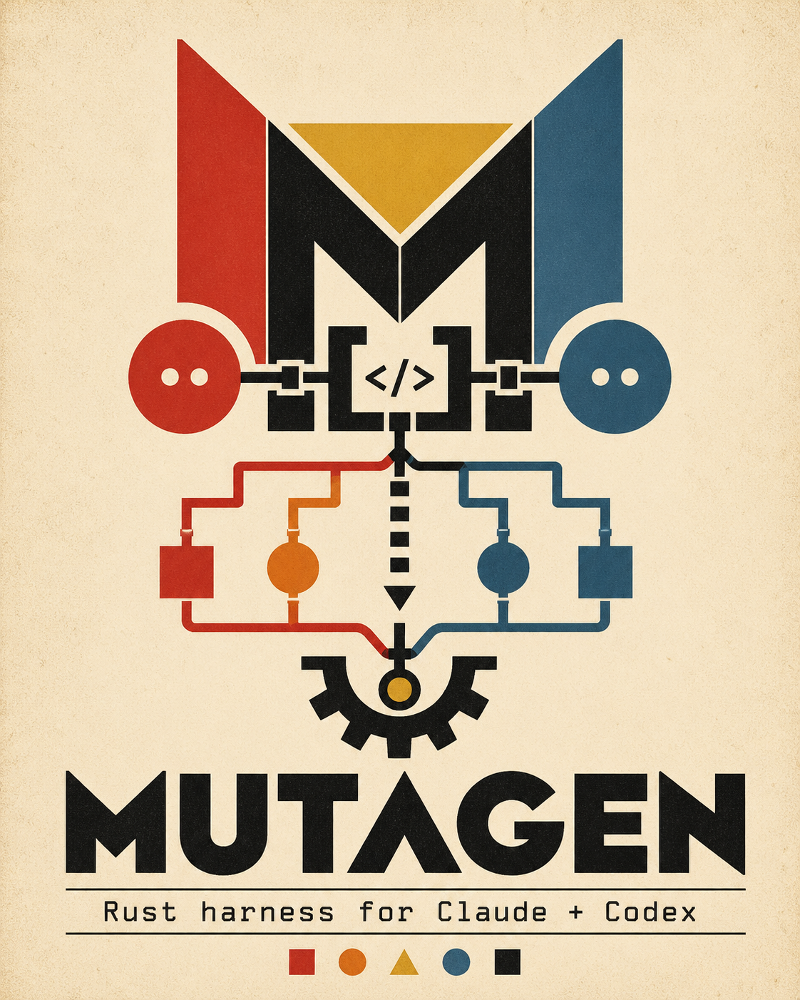
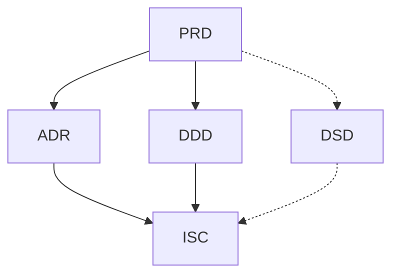

<p align="center">
  
</p>

# mutagen

The `mutagen` plugin packages an end-to-end agentic design workflow for Claude Code: thirteen subagents, a PreToolUse scope-enforcement hook, nine slash commands, plus templates and authoring guides for the five upstream design documents that feed the pipeline.

The flow is **User ↔ April → Shredder → Karai → {Bebop | Baxter | Chaplin | Metalhead | Splinter | Tatsu | Krang} → Karai (structural) → Bishop (review) → Tiger Claw (adversarial) → Karai → next slice**, with **Traag** wrapping every filesystem mutation any agent attempts.

## Install

The plugin is distributed through the marketplace at the root of this repository. Inside a Claude Code session:

```
/plugin marketplace add CHKDSKLabs/Mutagen
/plugin install mutagen@mutagen-marketplace
```

Verify:

```
/plugin list
```

For local development, point Claude Code at a checkout:

```bash
claude --plugin-dir /path/to/Mutagen/plugins/mutagen
```

Requires `bash`, `jq`, and `git` on PATH for the shell helpers. The slice-authoring flow, host-profile resolution, queue mutation helpers, active-slice stage rotation, Stage 2 structural gate, and final slice closure delegate to the Rust harness.

### Getting the harness binary

The harness binary is **not committed to the repo** (it would be platform-specific and would bloat clones). The plugin resolves the harness in this order:

1. `MUTAGEN_HARNESS_BIN`, when set to an executable.
2. `plugins/mutagen/bin/mutagen-harness` or `mutagen-harness.exe`, when packaged locally.
3. `cargo run --manifest-path harness/Cargo.toml` as a source-checkout fallback (requires `cargo`).
4. `mutagen-harness` on `PATH`.

For most users:

- **Have Rust installed?** The source-checkout fallback (#3 above) is enough. The first invocation will compile the harness; subsequent runs use the cached build.
- **Don't want to install Rust?** Download a pre-built binary from the [GitHub Releases page](https://github.com/CHKDSKLabs/Mutagen/releases) for your platform. Each tagged release ships archives for `x86_64-unknown-linux-gnu`, `aarch64-unknown-linux-gnu`, `x86_64-apple-darwin`, `aarch64-apple-darwin`, and `x86_64-pc-windows-msvc`, each with a `.sha256` checksum. Extract the archive, then either drop `mutagen-harness` (or `.exe`) at `plugins/mutagen/bin/` or point `MUTAGEN_HARNESS_BIN` at it.
- **Building from source for the canonical plugin-local path:** run

  ```bash
  bash plugins/mutagen/scripts/build_harness_binary.sh --release
  ```

  That writes `plugins/mutagen/bin/mutagen-harness` (or `.exe` on Windows). The path is in `.gitignore`; this is a per-machine artifact, not something you commit.

With a packaged binary, end users do not need `cargo` or `rustc`. Without a packaged binary, development checkouts still need Rust installed. Without `jq` the scope guard fails open with a warning; set `STRICT_GUARD=1` to fail closed instead.

Start a new app-builder workspace with:

```bash
bash plugins/mutagen/scripts/project.sh init \
  --name crew-scheduler \
  --stack nextjs-postgres \
  --design-system shadcn
```

Check the capsule and required artifacts:

```bash
bash plugins/mutagen/scripts/project.sh inspect
```

Apply the selected stack blueprint:

```bash
bash plugins/mutagen/scripts/project.sh blueprints
bash plugins/mutagen/scripts/project.sh apply-blueprint
```

Current stack IDs include `nextjs-postgres`, `vite-express-sqlite`,
`fastapi-react`, `aspnet-blazor`, `cloudflare-worker`, and `rust-bevy`.

Run a blueprint command through the capsule:

Create a project in one pass:

```bash
bash plugins/mutagen/scripts/project.sh create --name crew-scheduler --stack vite-express-sqlite --design-system plain-css
```

`create` runs init, blueprint application, and scaffold materialization.

Check local stack prerequisites:

```bash
bash plugins/mutagen/scripts/project.sh doctor
```

Summarize project status:

```bash
bash plugins/mutagen/scripts/project.sh status
```

Repair missing scaffold files:

```bash
bash plugins/mutagen/scripts/project.sh repair --scaffold
```

Queue a feature intent:

```bash
bash plugins/mutagen/scripts/project.sh add-feature --title "Add due dates" --description "Tasks should include optional due dates."
```

List queued feature intents:

```bash
bash plugins/mutagen/scripts/project.sh features
```

Plan a queued feature:

```bash
bash plugins/mutagen/scripts/project.sh plan-feature --feature-id feature-...
```

Inspect feature readiness:

```bash
bash plugins/mutagen/scripts/project.sh feature-status --feature-id feature-...
```

Slice a planned feature:

```bash
bash plugins/mutagen/scripts/project.sh slice-feature --feature-id feature-...
```

Enqueue a sliced feature:

```bash
bash plugins/mutagen/scripts/project.sh enqueue-feature --feature-id feature-...
```

Run full feature intake:

```bash
bash plugins/mutagen/scripts/project.sh feature-flow --title "Add due dates" --description "Tasks should include optional due dates."
```

Prepare the next feature slice:

```bash
bash plugins/mutagen/scripts/project.sh execute-feature --feature-id feature-...
```

Inspect feature progress:

```bash
bash plugins/mutagen/scripts/project.sh feature-progress --feature-id feature-...
```

Load the dashboard snapshot (read-only JSON; the embedded HTTP dashboard
has been retired in favour of the CLI surface):

```bash
bash plugins/mutagen/scripts/project.sh dashboard
```

For workspace-doctor checks, run:

```bash
bash plugins/mutagen/scripts/doctor_dev.sh --workspace-root /path/to/workspace
```

The operator surface for run control is the CLI: `/mutagen:execute-next`,
`/mutagen:status`, `/mutagen:pause`, `/mutagen:resume`, and
`/mutagen:amend-scope`.

Run a blueprint command through the capsule:

```bash
bash plugins/mutagen/scripts/project.sh run-command --kind test --dry-run
bash plugins/mutagen/scripts/project.sh run-command --kind test
```

Materialize the selected stack:

```bash
bash plugins/mutagen/scripts/project.sh scaffold
```

`scaffold` currently writes runnable `vite-express-sqlite` and `rust-bevy`
starters, and requires `--force` before replacing existing files.

Verify the generated project:

```bash
bash plugins/mutagen/scripts/project.sh verify-generated
```

This runs inspect, doctor, setup, test, build, preview-start, preview-check, and
preview-stop, then returns one JSON result for the whole loop.

Inspect the preview target:

```bash
bash plugins/mutagen/scripts/project.sh preview-plan
```

Manage the preview process:

```bash
bash plugins/mutagen/scripts/project.sh preview-start
bash plugins/mutagen/scripts/project.sh preview-status
bash plugins/mutagen/scripts/project.sh preview-check
bash plugins/mutagen/scripts/project.sh preview-stop
```

## The five upstream documents

| # | Doc | Full name | Answers |
|---|-----|-----------|---------|
| 1 | PRD | Product Requirements Document | *What* are we building, for whom, and why? |
| 2 | ADR | Architecture Design Record | *How*, at the system level, are we going to build it? |
| 3 | DDD | Domain-Driven Design (domain model) | What is the domain — bounded contexts, entities, ubiquitous language? |
| 4 | ISC | Implied Systems Contract | What contracts between systems fall out of the architecture and domain model? |
| 5 | DSD | Design Style Guide | What conventions (UX, visual, code) must every slice conform to? |

Workflow order:



Solid arrows are authoring dependencies (the target cannot be completed until the source is stable). Dotted arrows are cross-cutting influences (the source constrains the target but does not block its authoring).

Ordering rules:

1. **PRD is authored first.** No other document starts until the PRD is stable enough to reference.
2. **ADR and DDD are authored in parallel** once the PRD is stable.
3. **ISC depends on both ADR and DDD** being stable enough to name the contracts.
4. **DSD is a living document.** It is initiated alongside the PRD and evolves in parallel; it binds the ISC and every downstream slice.
5. **Changes propagate downstream.** A PRD change may invalidate ADR, DDD, or ISC; impact must be tracked explicitly and the affected documents re-reviewed.

## Templates & authoring guides

Each of the five upstream documents has a **template** (the shape) and an **authoring-and-review guide** (how to fill it well and how to review it). Start with [`guides/README.md`](guides/README.md) for the shared principles.

| Doc | Template | Guide |
|-----|----------|-------|
| PRD | [`templates/PRD-template.md`](templates/PRD-template.md) | [`guides/PRD-guide.md`](guides/PRD-guide.md) |
| ADR | [`templates/ADR-template.md`](templates/ADR-template.md) | [`guides/ADR-guide.md`](guides/ADR-guide.md) |
| DDD | [`templates/DDD-template.md`](templates/DDD-template.md) | [`guides/DDD-guide.md`](guides/DDD-guide.md) |
| ISC | [`templates/ISC-template.md`](templates/ISC-template.md) | [`guides/ISC-guide.md`](guides/ISC-guide.md) |
| DSD | [`templates/DSD-template.md`](templates/DSD-template.md) | [`guides/DSD-guide.md`](guides/DSD-guide.md) |

## The agent syndicate

| Agent | Role | File |
|-------|------|------|
| April | Design-phase elicitor & document author (upstream of Shredder) | [`agents/April.md`](agents/April.md) |
| Shredder | Slicer & queue author | [`agents/Shredder.md`](agents/Shredder.md) |
| Karai | Execution supervisor & dispatcher | [`agents/Karai.md`](agents/Karai.md) |
| Traag | Filesystem scope enforcer (cross-cutting) | [`agents/Traag.md`](agents/Traag.md) |
| Krang | Infrastructure & DevOps (Layer 1, deploy L6) | [`agents/Krang.md`](agents/Krang.md) |
| Baxter | Math-heavy / algorithmic execution | [`agents/Baxter.md`](agents/Baxter.md) |
| Tatsu | Security-minded execution (Layer 3 + security-critical cross-cutting) | [`agents/Tatsu.md`](agents/Tatsu.md) |
| Chaplin | Data / schema specialist (non-trivial L2 + data-migration L6) | [`agents/Chaplin.md`](agents/Chaplin.md) |
| Metalhead | Observability engineer (L1 scaffold, instrumentation, SLO / alerts / dashboards) | [`agents/Metalhead.md`](agents/Metalhead.md) |
| Splinter | Technical writer (human-facing docs derived from shipped code and state) | [`agents/Splinter.md`](agents/Splinter.md) |
| Bebop | Standard execution (Layers 2 trivial, 4, 5, non-deploy L6) | [`agents/Bebop.md`](agents/Bebop.md) |
| Bishop | Principal-level code review (post-structural, pre-QA) | [`agents/Bishop.md`](agents/Bishop.md) |
| Tiger Claw | Adversarial QA (post-review, pre-completion) | [`agents/TigerClaw.md`](agents/TigerClaw.md) |

Shredder's slicing order follows a 6-layer dependency hierarchy (Foundation → Data → Security → Logic → Interface → Features) and groups slices within each layer by DDD bounded context. Every slice cites the specific `[FR-*]`, `[NFR-*]`, `ADR-N`, DDD element, `[ISC-NNN]`, and `[DSD-###]` it touches; Karai enforces that every returned output preserves those citations and upholds every cited invariant before the queue advances.

Traag closes the scope-security gap that raw harness permissions cannot express: instead of "allow all writes" or "prompt on every write," Traag evaluates each `Write` / `Edit` / delete against a per-slice scope manifest plus a global denylist (secrets, `.git`, lock files, infra config outside Krang's slices, upstream design artifacts). Deny is the default on any ambiguity; a DENY blocks the mutation and fires as a Red inspection outcome in Karai, halting the slice and surfacing the Violation Report to the human. There is no "just this once" override — amendments happen upstream by amending the manifest or re-slicing via Shredder.

## Session ritual — host-aware command surface

The command surface is host-aware:

- **Claude Code** — slash commands, namespaced `mutagen:`. Sources live in
  `plugins/mutagen/commands/<name>.md`. Invoke as `/mutagen:<name>`.
- **Codex** — explicit-only skills, namespaced `mutagen-`. Sources live in
  `plugins/mutagen/skills/mutagen-<name>/SKILL.md`. Invoke as
  `$mutagen-<name>`.

The two surfaces drive the same shell scripts under `plugins/mutagen/scripts/`
and the same Rust harness, so the workflow is identical — only the entrypoint
differs. The table below uses Claude form first; the matching Codex name is
parenthesised.

| Command | Purpose |
|---------|---------|
| `/mutagen:elicit`        (`$mutagen-elicit`)        | Run April to interview you and author / iterate the five upstream documents. Persists her Readiness Brief to `.mutagen/state/readiness-brief.{md,json}`. |
| `/mutagen:slice`         (`$mutagen-slice`)         | Run Shredder on the approved bundle to produce a dependency-ordered slice queue. Emits `slices/queue.json` (canonical) and `slices/slicemap.md` (human-readable), refreshes legacy `slices/queue.md` as a compatibility shadow, then validates the queue through the harness before handing it to Karai. Persists Shredder's Validation Report to `.mutagen/state/validation-report.{md,json}` and the harness queue-validator report to `.mutagen/state/queue-validation.json`, including queue-contract freshness metadata so normal runtime bookkeeping does not falsely stale the queue. |
| `/mutagen:execute-next`  (`$mutagen-execute-next`)  | Run Karai on the next pending slice. Wraps `scripts/run_execute_next.sh`. Stops at queue clear, stalled deps, escalation, queue-validation failure, or — when the operator drops `.mutagen/state/pause.json` — `status: "paused"`. The harness owns sibling selection, targeted slice materialization, stage dispatch prep, structural gating, verdict recording, retry branching, canonical closeout, state-update application, and notification planning. |
| `/mutagen:resume`        (`$mutagen-resume`)        | Resume after a manual repair: optionally flip the slice back to `in_progress`, re-run structural-check on the repaired author output, and dispatch review. One-shot — does not loop. |
| `/mutagen:pause`         (`$mutagen-pause`)         | Stage-boundary pause / resume / status for the execute-next loop. `pause on --reason TEXT` makes the next iteration stop before claiming a slice; `pause off` clears the sentinel. Does not pre-empt work already in flight. |
| `/mutagen:amend-scope`   (`$mutagen-amend-scope`)   | Evaluate a mid-slice amendment request through the harness `amend-scope` runtime. The runtime enforces stage fidelity, active-agent domain, and global deny rules, rewrites `.mutagen/state/active-slice.json` on ALLOW, appends `.mutagen/state/amendments.jsonl` on both ALLOW and DENY, and returns the canonical rationale / next-step payload. |
| `/mutagen:status`        (`$mutagen-status`)        | Read-only report on upstream-document status, April's Readiness Brief, Shredder's Validation Report, harness queue-validation state, queue progress, active slice, latest scope-violation artifact, heartbeat telemetry, gate verdicts, and open escalations. |
| `/mutagen:consolidate-advisories` (`$mutagen-consolidate-advisories`) | Promote Bishop's 🟡 Advisory backlog (`.mutagen/state/advisory-backlog.jsonl`) into one or more cleanup slices via Shredder. Without this, advisories accumulate in `reviews/` and never get addressed. |
| `/mutagen:setup-pushover` (`$mutagen-setup-pushover`) | First-run wizard for Pushover notifications. |

Stage dispatch is host-aware. `--host codex` runs personas through `codex exec`
using `CODEX_BIN` when set; `--host claude` runs them through the packaged
non-interactive wrapper `bin/claude-harness.sh` (which calls `claude --print
--permission-mode bypassPermissions`) using `CLAUDE_BIN` when set. Set
`MUTAGEN_AGENT_LAUNCHER` to replace the launcher for either host or for a
future host adapter.

If a host-specific install does not surface the plugin's commands or skills
(for example: a portable copy under `.mutagen/mutagen/` that the host did not
register), fall back to invoking the persona directly:

```bash
bash "$MUTAGEN_ROOT/bin/agent.sh" --host claude Shredder "<task>"
bash "$MUTAGEN_ROOT/bin/agent.sh" --host codex  Shredder "<task>"
```

Typical rhythm on a new project:

1. **Session 1 — elicit.** `/mutagen:elicit` until every upstream doc is Approved / Accepted and April's Readiness Brief returns green across the board.
2. **Session 2 — slice.** `/mutagen:slice` produces the queue.
3. **Sessions 3…N — execute.** Run `/mutagen:execute-next` and let it drain slices until the queue clears or a stage halts. `/mutagen:status` any time to check where things are.

## Scope enforcement

A `PreToolUse` hook on `Write` / `Edit` reads `.mutagen/state/active-slice.json` (written by `/mutagen:elicit`, `/mutagen:slice`, and `/mutagen:execute-next` before dispatch) and blocks writes outside the slice's declared allowlist. A universal denylist also protects the design scaffolds (`templates/**`, `guides/**`) and instantiated upstream bundle (`docs/PRD*`, `docs/ADR*`, `docs/DDD*`, `docs/ISC*`, `docs/DSD*` and repo-root variants) from edits by anyone other than April (or an explicit `CLAUDE_WORKFLOW_META=1` override for plugin-internal work).

Blocks return exit code 2 with a stderr message that surfaces to Claude as the reason. Extending scope is a deliberate edit to `.mutagen/state/active-slice.json` — there is no "just this once" bypass.

## Pushover notifications (optional)

Long `/mutagen:execute-next` runs auto-advance through the queue without prompting. To find out when the pipeline halts without staring at the terminal, wire in [Pushover](https://pushover.net/): whenever a slice escalates (retry budget exhausted, Karai structural fail, or Traag scope denial) the plugin fires a push to your phone. Queue-clear is also supported as an opt-in success ping. Queue-clear, structural-fail, retry-budget, and layer-complete events now originate in the harness runtime and get relayed through the existing shell transport.

**The easy way: run `/mutagen:setup-pushover`.** It walks you through detection → credentials → storage choice → test push in one conversational pass, handles the secrets carefully, and can gitignore `.claude/workflow.json` for you if you pick the file-storage path.

Or do it by hand, one of two ways:

**Environment variables** (simplest, secrets stay out of the repo):

```bash
export PUSHOVER_USER_KEY=uQiRz...
export PUSHOVER_APP_TOKEN=azGDO...
```

**`.claude/workflow.json`** (project-scoped; do not commit if you put the keys here):

```json
{
  "notifications": {
    "pushover": {
      "enabled": true,
      "user_key": "uQiRz...",
      "app_token": "azGDO...",
      "quiet_events": ["queue_clear"]
    }
  }
}
```

Env vars override the file. If neither path yields both a user key and an app token, `scripts/notify.sh` silently no-ops — the plugin works fine without notifications configured. The script also bails silently on missing `curl`, so a Pushover outage or a sandbox without network never blocks a pipeline halt.

Events the plugin emits:

| Event | Priority | When it fires |
|-------|----------|----------------|
| `escalation` | high | retry budget exhausted on a slice (Bishop Block or Tiger Claw Defect after `max_retries` author retries) |
| `structural_fail` | high | Karai returns a structural conformance failure on a slice |
| `scope_violation` / `traag_deny` | high | Traag blocks a Write / Edit during any stage |
| `queue_clear` | normal | queue ran to completion cleanly |
| `user_interrupt` | — | currently suppressed; you're already at the keyboard |

Silence specific events with `notifications.pushover.quiet_events: ["queue_clear", ...]` in `workflow.json`. Set `notifications.pushover.enabled: false` to hard-disable even when keys are present in the file.

## Pipeline modes

Two modes, selected per project via `.claude/workflow.json`:

- **`full`** (default) — Bishop review + Tiger Claw QA on every slice.
- **`lightweight`** — those gates run only on slices Shredder tags `review_required: true` based on criteria in [`guides/pipeline-modes.md`](guides/pipeline-modes.md) (security, non-trivial data, external-contract changes, production infra, irreversibility, observability contracts, size thresholds, or explicit author opt-in).

Karai's structural conformance, Traag's scope enforcement, and every executor's showpiece run in both modes. Lightweight only trims Bishop and Tiger Claw. Adopting lightweight mode should be captured as the project's first ADR — opinionated template in [`guides/pipeline-modes.md`](guides/pipeline-modes.md).

## Per-stage scope manifest rotation

Plugin subagents can't declare their own `PreToolUse` hooks per the official Claude Code spec, and the hook doesn't receive the current subagent name. Instead of resigning to a union allowlist, `/mutagen:execute-next` **rewrites `.mutagen/state/active-slice.json` between stages** so each subagent only sees the write paths it actually needs: author paths during stage 1, `reviews/**` during Bishop, `tests/qa/**` during Tiger Claw, and the state files during Karai's verification stage. The guard hook reads the current manifest literally, so rotation gives effective per-subagent enforcement without per-subagent hooks.

See [`commands/execute-next.md`](commands/execute-next.md) for the stage-by-stage manifest table.

If a project needs even stricter enforcement (e.g. per-path audit trails keyed to agent identity), a future option is to install the subagents into the project's `.claude/agents/` (not as a plugin) and attach per-subagent hooks in frontmatter — which project-level subagents do support.
