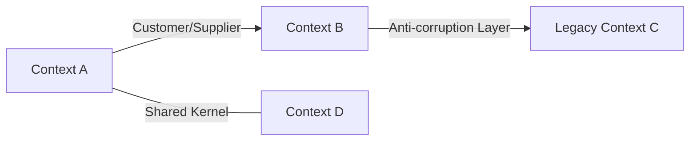

# DDD: <Product or Initiative Name>

*Domain-Driven Design document. Captures the **domain model** — the bounded contexts, the ubiquitous language, and the relationships between them — in a form the ADR and ISC can depend on. Modeling follows Evans / Vernon DDD practice.*

## Metadata

| Field | Value |
|-------|-------|
| Document ID | DDD-NNNN |
| Status | Draft / In Review / Approved |
| Owner | <name> |
| Authors | <names> |
| Domain experts consulted | <names> |
| Created | YYYY-MM-DD |
| Last updated | YYYY-MM-DD |
| Related PRD | PRD-NNNN |
| Related ADRs | ADR-NNNN, ... |
| Related ISC | <link> |
| Related DSD | <link> |

## 1. Summary

*One paragraph. Which business domain is being modeled, what sub-domains exist, and why this model is the right one. Classify each sub-domain as **core**, **supporting**, or **generic** — this drives investment decisions downstream.*

| Sub-domain | Type (core / supporting / generic) | Notes |
|------------|------------------------------------|-------|

## 2. Ubiquitous Language

*Shared vocabulary used across PRD, ADR, ISC, and DSD. Resolve ambiguities here. If the same word has different meanings in different bounded contexts, list each meaning with its context.*

| Term | Definition | Bounded context(s) | Synonyms to avoid | Notes |
|------|------------|--------------------|-------------------|-------|

## 3. Bounded Contexts

*One subsection per bounded context. A bounded context is a boundary within which a single, consistent model applies. Pick names that appear in the ubiquitous language.*

### 3.1 <Context Name>

- **Purpose:** *One sentence on what this context is responsible for.*
- **Sub-domain type:** core / supporting / generic
- **Owning team:** *<team>*
- **Upstream PRD references:** *[FR-*] / [NFR-*] IDs*
- **Related ADRs:** *ADR-...*

#### Aggregates

| Aggregate root | Invariants | Transaction boundary | Notes |
|----------------|------------|----------------------|-------|

#### Entities

| Entity | Identity | Lifecycle | Owning aggregate | Notes |
|--------|----------|-----------|------------------|-------|

#### Value Objects

| Value object | Fields | Equality rule | Notes |
|--------------|--------|---------------|-------|

#### Domain Events

| Event | Emitted when | Payload | Consumers |
|-------|--------------|---------|-----------|

#### Commands

| Command | Actor | Pre-conditions | Post-conditions | Emitted events |
|---------|-------|----------------|-----------------|----------------|

#### Queries

| Query | Actor | Returns | Consistency (strong / eventual) |
|-------|-------|---------|----------------------------------|

#### Invariants & Business Rules

*Numbered so the ISC and downstream slices can cite them.*

- [INV-1] ...
- [INV-2] ...

#### Policies / Sagas

*Cross-aggregate or cross-context reactions. "When X happens, then Y."*

- [POL-1] ...

### 3.2 <Next Context>

*(repeat)*

## 4. Context Map

*Show how contexts relate. Use the standard DDD relationship patterns: Partnership, Shared Kernel, Customer/Supplier, Conformist, Anti-corruption Layer, Open-host Service, Published Language, Separate Ways, Big Ball of Mud.*

| Upstream | Downstream | Pattern | Shared artifacts | Notes |
|----------|------------|---------|------------------|-------|

## 5. Cross-cutting Concerns

*How the model handles concerns that span contexts: identity, tenancy, authorization, audit, time, money / currency, localization, PII, soft-delete. State the single source of truth for each.*

| Concern | Source of truth | Contexts that consume it | Notes |
|---------|-----------------|--------------------------|-------|

## 6. Modeling Decisions

*Significant modeling choices that are not large enough for their own ADR but still need to be recorded. "We treated X as a value object rather than an entity because …"*

- MD-1. ...
- MD-2. ...

## 7. Open Modeling Questions

*Unresolved naming, boundary, or invariant questions. Each must have an owner and a due date; questions without both are blockers, not open questions.*

| # | Question | Owner | Due | Blocks |
|---|----------|-------|-----|--------|

## 8. Change Log

| Date | Author | Change |
|------|--------|--------|
